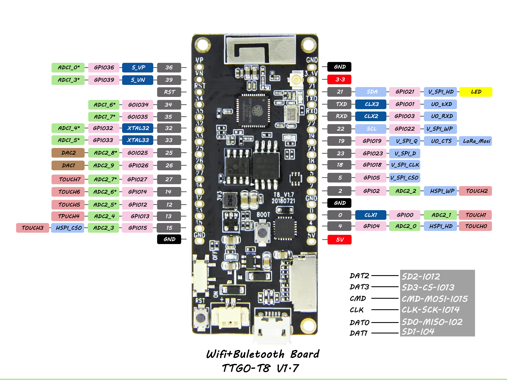
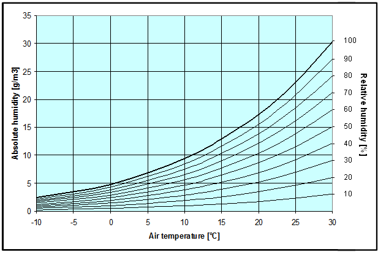

The Log-O-Nator
===============

Measuring Temperature & Humidity and logging it in a Google spreadsheet in the cloud.

Boards used:
* Adafruit Si7021
* ESP32 TTGO T8 v1.7.1

Good information about sensor (also check other subpages):  
https://learn.adafruit.com/adafruit-si7021-temperature-plus-humidity-sensor/overview

How to use
==========

Connect Si7021 to ESP32
-----------------------

The usual i2C pins have been switched to other pins to be able to control the LED.

The i2C pins on the esp have been set to:
* SDA = 23
* SCL = 18

Connect 5V of the ESP to the Vin of the Si7021.
The 3V pin is an output pin (up to 100mA).

Download VSCode and install platformio package
----------------------------------------------

Follow this video to flash your device.
https://www.youtube.com/watch?v=qbETf0c3jZM

Create google spreadsheet
---------------------------

There is a script here called googleScripts.gs  
It was adjusted from this video:  
https://www.youtube.com/watch?v=fS0GeaOkNRw

Follow the instructions in the video to see how to set it up.  
Note: If you want to update the script, I always had to select a new version, otherwise nothing happened.

Set up Environment.hpp
----------------------

Take `EnvironmentTemplate.hpp` and rename it to `Environment.hpp`.  
Fill in the missing values:  
- wifi ssid
- wifi password
- google app service id

That should be everything, have fun. :)

Image Source: https://github.com/LilyGO/TTGO-T8-ESP32

Set up desired up- / down-time and sampling rate
------------------------------------------------

The board can be set into a deep sleep to save power.  
In the `Parameters.hpp` file you can set up these three values:

- Sampling Rate: How often to sample measurements when awake
- Up time: For how long is the board awake between sleeping periods
- Sleep time: For how long to sleep. No measurements will be done when sleeping but power is saved.

What is humidity again exactly?
===============================

Humidity is a measure of how much water is within the air in gaseous form (steam).  
There is relative and absolute humidity.

Relative humidity
-----------------
Depending on pressure and temperature the air can store more or less water before it's saturated.  
Cold air can store less water. The relative humidity measures how much percent of the maximum amount
of water is stored in the air. 

Example:
Imagine you're in a room. The air in the room can take 1 liter of water (made up value, dont know what's realistic).
But because of the climate you're in at the time, the room air contains only 500ml of steam.
Thus the relative humidity would be 500ml/1000ml = 50%. Now you increase the temperature inside the room, the water can store more water now.  
Lets say it can store 2 liters of water now. The water in the air didn't increase due to warming the room and is still 500ml.
Thus the relative humidity is now 500ml/2000ml = 25%.  
When the air gets colder it can hold less water. As the water content doesn't change, the relative humidity reaches 100% at some point and the air is fully saturated with steam. What happens if the air gets even colder then? The water in the air condenses and small water particles are created. We call these water particles clouds or fog. :) Fog is nothing else than a cloud on the ground.

Absolute humidity
-----------------
The absolute humidity measures how much water is in the air in absolute values.  
It is measured in g/m^3. In the example above, the relative humidity changed due to temperature changes.  
The amount of water stayed the same though. And this is what the absolute humidity would tell you.  
In both cases the absolute humidity stays the same. Note that the absolute humidity would not be 1 liter.  
First of all it is measured as a weight (and not liter, 1l ≈ 1kg) and secondly, it is measured by m^3.  
So you need to take the steam weight in the whole room and divide by the m^3 of the room to get the absolute humidity.

How much steam can air take?
----------------------------

0°C: 4.8g/m^3  
10°C: 9.4g/m^3  
30°C: 30.3g/m^3

As the air gets warmer, it can store a lot more water.  
This is the reason why there is more rain when it's warm.

In the following image you can see the curves how the maximum water storage capacity of the air changes with temperature.

Image Source: https://wiki.unece.org/display/TransportSustainableCTUCode/2%09Definitions

What do we measure with our sensor?
-----------------------------------
The sensor (Si7021) measures relative humidity (RH). It has ± 3% relative humidity measurements with a range of 0–80% RH.  
As the sensor also measures temperature, you can calculate the absolute humidity from the relative humidity.  
For that you need the data from the diagram. You can see for example that at 30°C and 50% RH, the absolute humidity is 15g/m^3.

Temperature Excourse  
±0.4 °C temperature accuracy at a range of -10 to +85 °C. 

Why is the air more dry in the winter?
--------------------------------------
In the winter there is less water in the air as it's colder. When you open the window you let cold air in that doesn't have a lot of water. But the relative humidity might be in a good range still. But now you heat up the air and thus the maximum water capacity of the air rises a lot. But the water content in the air stays the same. This means that the relative humidity decreases a lot. This is what causes the dry air in the winter (heating up of cold air).

What are good conditions for humans?
------------------------------------
Good conditions are 40-60% relative humidity. When the air is less satured (lower RH) it tries to saturate itself more by absorbing water from things in the environment. So the air takes water from your body. This is for example the reason for dry lips in the winter. It can also harm your immune system and you get more likely to get an airborne infection (I guess because the mucous membrane in your nose dries out). Dry air can also harm objects by taking water from them, e.g. wood furniture can get cracks as water is taken from it.
